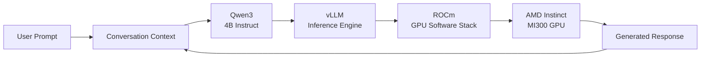

<div align="center">

# Qwen3 × vLLM on AMD Instinct MI300

### High-performance LLM inference on AMD GPU infrastructure

<br>


&nbsp;&nbsp;&nbsp;&nbsp;

&nbsp;&nbsp;&nbsp;&nbsp;

&nbsp;&nbsp;&nbsp;&nbsp;


<br><br>

**Qwen3-4B-Instruct-2507 · vLLM · AMD Instinct MI300 · ROCm · Python**

</div>

---

## Overview

This project explores an end-to-end **large language model inference workflow on AMD GPU infrastructure**, using **Qwen3-4B-Instruct-2507** with **vLLM** on an **AMD Instinct MI300 GPU**.

The implementation focuses on the inference layer rather than an API abstraction — loading the model directly into the GPU environment, maintaining conversational context, controlling generation behaviour, and interacting with the model through a lightweight interface.

The setup provides a compact environment for experimenting with how **model configuration, prompting and sampling parameters** influence generated responses.

---

## Architecture



### Runtime Stack

| Layer             | Technology                 | Role                            |
| ----------------- | -------------------------- | ------------------------------- |
| 🧠 Model          | **Qwen3-4B-Instruct-2507** | Language generation             |
| ⚡ Inference       | **vLLM**                   | LLM inference runtime           |
| 🖥️ Accelerator   | **AMD Instinct MI300**     | GPU compute                     |
| 🔧 GPU Software   | **ROCm**                   | AMD GPU software stack          |
| ☁️ Environment    | **AMD Developer Cloud**    | GPU compute environment         |
| 🐍 Implementation | **Python**                 | Application and inference logic |

---

## What This Implementation Covers

### Conversational Inference

The chatbot maintains a conversation history and passes the accumulated messages to Qwen3 during inference.

This allows the model to respond within the context of the ongoing interaction rather than treating every prompt as an isolated request.

### System Prompt Conditioning

System-level instructions can be used to define the model's role, behaviour, tone and response style.

This provides a simple way to create specialised assistant behaviours without modifying the underlying model.

### Generation Control

The inference workflow exposes several sampling parameters:

**Temperature**

Controls the randomness of token selection.

```text
Lower temperature → more deterministic
Higher temperature → more varied
```

**Top-p**

Controls the probability mass considered during sampling.

```text
Lower top-p → narrower candidate distribution
Higher top-p → broader candidate distribution
```

**Max Tokens**

Controls the maximum length of the generated response.

---

## Core Inference Pattern

```python
from vllm import LLM, SamplingParams

model_name = "Qwen/Qwen3-4B-Instruct-2507"

llm = LLM(model=model_name)

conversation = [
    {
        "role": "system",
        "content": "Your instructions here"
    },
    {
        "role": "user",
        "content": "Your message"
    }
]

sampling_params = SamplingParams(
    temperature=0.7,
    max_tokens=200,
    top_p=0.9
)

outputs = llm.chat(
    conversation,
    sampling_params
)

response = outputs[0].outputs[0].text
print(response)
```

---

## Interactive Generation Controls

The notebook also includes an interactive interface for adjusting inference parameters.

This makes it possible to experiment with generation behaviour without changing the underlying inference logic.

```text
Temperature   ───────────────●────
Max Tokens    ────────●───────────
Top-p         ───────────●────────
```

The objective is to observe how relatively small changes in sampling configuration can alter response diversity, determinism and output length.

---

## Technology Stack

<div align="center">

| Technology               | Purpose                        |
| ------------------------ | ------------------------------ |
| **Qwen3**                | Foundation language model      |
| **vLLM**                 | High-performance LLM inference |
| **AMD Instinct MI300**   | GPU acceleration               |
| **ROCm**                 | AMD GPU compute software stack |
| **AMD Developer Cloud**  | Cloud GPU environment          |
| **Python**               | Inference implementation       |
| **Jupyter / ipywidgets** | Interactive experimentation    |

</div>

---

## Repository Structure

```text
qwen3-vllm-amd-mi300-inference/
│
├── assets/
│   ├── amd-logo.svg
│   ├── qwen-logo.svg
│   ├── vllm-logo.svg
│   └── rocm-logo.svg
│
├── chatbot_vllm.ipynb
├── requirements.txt
├── .gitignore
└── README.md
```

---

## Running the Notebook

### 1. Clone the repository

```bash
git clone https://github.com/ameer5511/qwen3-vllm-amd-mi300-inference.git

cd qwen3-vllm-amd-mi300-inference
```

### 2. Install dependencies

```bash
pip install -r requirements.txt
```

### 3. Launch Jupyter

```bash
jupyter notebook
```

Open:

```text
chatbot_vllm.ipynb
```

> **Hardware note:** The notebook is designed around an AMD GPU environment and specifically targets an AMD Instinct MI300-class setup.

---

## Experiments & Extensions

The current implementation provides a foundation for further inference experiments.

Potential extensions include:

* benchmarking different generation configurations
* comparing sampling strategies
* evaluating response latency
* measuring token throughput
* experimenting with longer conversation contexts
* testing additional Qwen model variants
* exposing the inference engine through an API
* turning the notebook interface into a standalone application
* investigating model quantization and memory behaviour

---

## Key Takeaway

The interesting part of this setup is the interaction between the **model, inference runtime and accelerator stack**.

```text
Qwen3
  ↓
vLLM
  ↓
ROCm
  ↓
AMD Instinct MI300
```

Rather than treating an LLM as a black-box API, this project provides a direct look at the inference path running on AMD GPU infrastructure.

---

## Attribution

This implementation was developed while working through **AMD AI Academy hands-on material** and experimenting with the Qwen3 + vLLM inference stack.

The repository documents the implementation and experimentation in a personal engineering context.

AMD, AMD Instinct and ROCm are trademarks or registered trademarks of Advanced Micro Devices, Inc.

Qwen and vLLM are separate open-source projects maintained by their respective communities.

---

<div align="center">

### Built around open AI infrastructure.

**Qwen3 · vLLM · ROCm · AMD Instinct**

</div>
